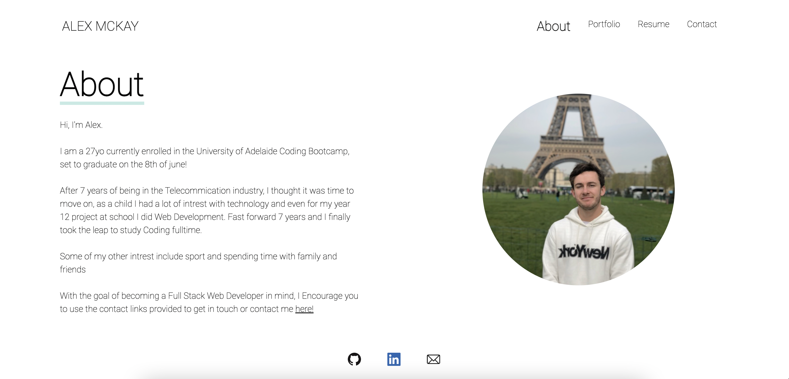
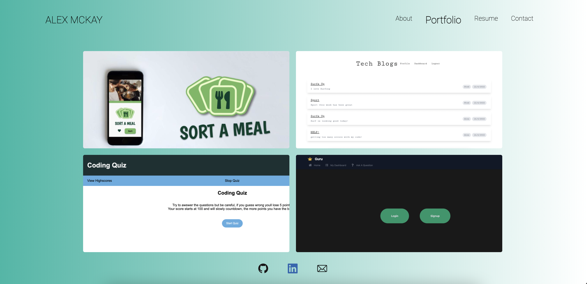
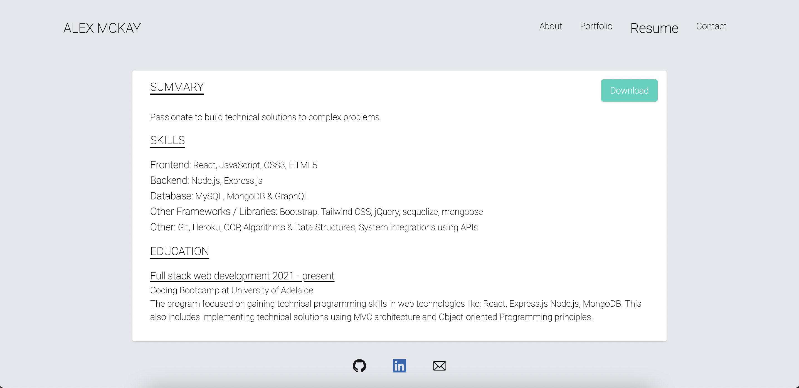
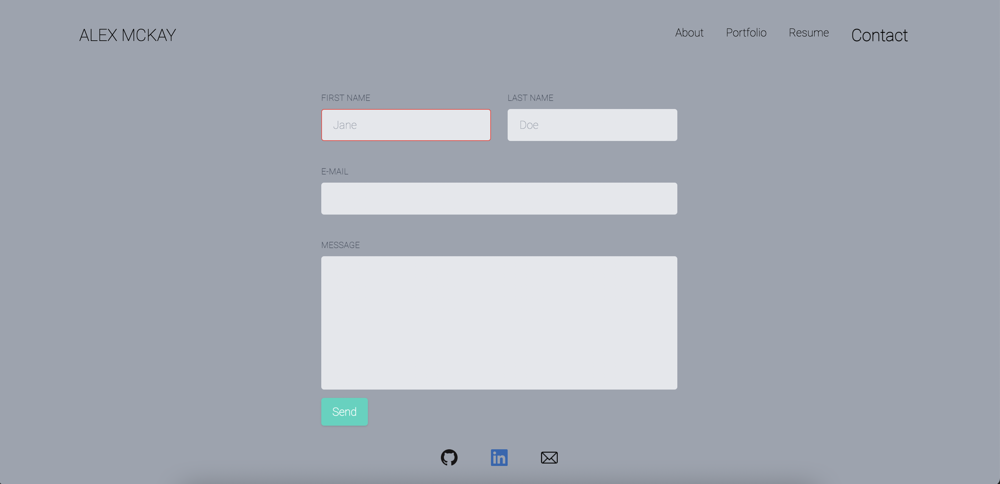

# Week20-Homework

# React Portfolio

## Description 

Here is my portfolio website, where one can view info about me, my current and ongoing projects as well as get in touch.
currently I have 4 projects, but as I work on more I'll be adding to this.

## Table of contents 

- [Screenshots](#screenshots) 
- [Technologies](#technologies) 
- [Installation](#installation)
- [Resources](#resources) 
- [Contact](#contact)
  
## Screenshots 
---

*Homepage*

*About*

*Portfolio*

*Resume*

*Contact*

## Technologies
***
A list of technologies used within the project:

- Javascript
- GIT
- REACT
- HTML
- CSS
- Tailwind CSS Framwork

## Installation
In the project directory, you can run:

### `npm start`

Runs the app in the development mode.\
Open [http://localhost:3000](http://localhost:3000) to view it in your browser.

The page will reload when you make changes.\
You may also see any lint errors in the console.

### `npm test`

Launches the test runner in the interactive watch mode.\
See the section about [running tests](https://facebook.github.io/create-react-app/docs/running-tests) for more information.

### `npm run build`

Builds the app for production to the `build` folder.\
It correctly bundles React in production mode and optimizes the build for the best performance.

The build is minified and the filenames include the hashes.\
Your app is ready to be deployed!

See the section about [deployment](https://facebook.github.io/create-react-app/docs/deployment) for more information.

## Resources

[Github Repo](https://github.com/mckayjalex/react-portfolio)

[Live Site](https://shrouded-river-38098.herokuapp.com/)

## Contact

GitHub: [GitHub](https://github.com/mckayjalex) Email: [alexjosephmckay@gmail.com](alexjosephmckay@gmail.com)
